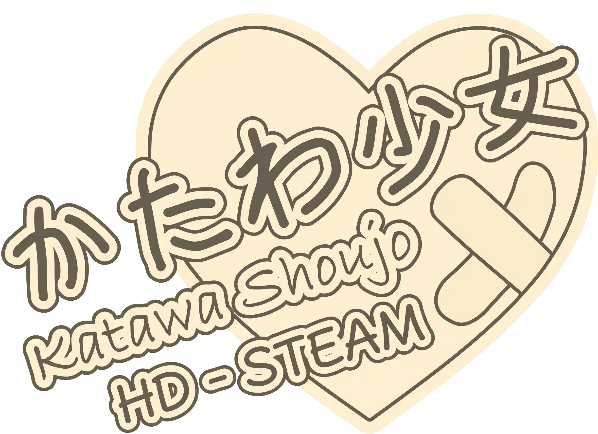

<p align="center">
  
</p>

# Katawa Shoujo HD Patch — Steam Edition

**Play the Steam version of Katawa Shoujo in 1920×1080, with the adult content in HD too.**

> This is an adaptation of the [Katawa Shoujo HD Patch](https://github.com/letow/KatawaShoujoHDPatch) by **letow**.
> All the HD artwork (backgrounds, sprites, CGs, UI, effects and videos) comes from that project.
> This patch only ports it to the Steam release of the game. Full credits are at the end.

## Description

The original HD patch was made for the StandAlone release of Katawa Shoujo (Ren'Py 6.10, adult content
included). The Steam release runs on a newer Ren'Py (6.16.5), moved the adult content into a separate
`r18.rpa` patch with low-resolution images, and has its own features. Because of that, applying the
original patch to the Steam version makes the game crash.

This edition brings the same HD remaster to the Steam version and includes the R18 patch in HD.

### Visual Changes

This edition is a code adaptation only. It adds no new visual changes: the game looks exactly as it does
with the original HD patch. To see the before/after comparisons, visit the
[original Katawa Shoujo HD Patch repository](https://github.com/letow/KatawaShoujoHDPatch).

## Languages Available

English, Spanish, French, Japanese, German, Korean, Polish, Brazilian Portuguese, Russian,
Simplified Chinese and Traditional Chinese: all 11 languages shipped with the Steam version.

## Installation

No installer needed.

> **Download the patch from the [Releases](https://github.com/ohshya/KatawaShoujoSteamHD/releases/latest) page,
> not from the repository files.** The HD archives (`patch-hd.rpa`, about 670 MB, and `r18-hd.rpa`) are too
> large for a GitHub repository, so they're only included in the release zip. Without them the patch
> won't work.

1. Download [`KS.HD.1.0.0.STEAM.zip`](https://github.com/ohshya/KatawaShoujoSteamHD/releases/download/v1.0.0/KS.HD.1.0.0.STEAM.zip) from the latest release.
2. In Steam, right-click **Katawa Shoujo** > **Manage** > **Browse local files**.
3. Extract the zip into that folder (the one containing `Katawa Shoujo.exe`).
4. When asked, choose **replace all files**.
5. Launch the game from Steam as usual.

**Linux and macOS:** the patch only replaces game data (scripts and archives), which is the same on every
system, so it works the same way. On Linux the steps are identical. On macOS, **Browse local files** opens a
folder with the game app: right-click it, choose **Show Package Contents** and look for the `game` folder
inside; merge the zip's `game` folder into it.

You don't need the official `r18.rpa`. If it's already in the folder you can leave it there; the game
will use the HD version automatically.

**To uninstall:** delete `game/patch-hd.rpa` and `game/r18-hd.rpa`, then in Steam go to
**Properties** > **Installed Files** > **Verify integrity of game files**.

> A Steam update may overwrite the patched scripts. If that happens, just extract the patch again.

### What's inside the release zip

| File | Description |
|---|---|
| `game/patch-hd.rpa` | HD backgrounds, sprites, CGs, UI, effects and videos. |
| `game/r18-hd.rpa` | The R18 patch (scenes and images) in HD. Replaces the official `r18.rpa`. |
| `game/*.rpyc` | Steam game scripts with the HD layout adjustments, for all 11 languages. |
| `game/presplash.png` | HD patch loading screen. |

## Additional Changes

Things this edition adds that the original HD patch didn't have:

- **Steam version support.** The HD adjustments (resolution, positions, zooms, pans, UI layout) were
  re-applied on top of the Steam scripts instead of replacing them. Steam-only features keep working:
  achievements, controller support, the adult-content toggle and the packed language files.
- **HD R18 patch.** The official Steam `r18.rpa` only has low-resolution images. `r18-hd.rpa` contains the
  same scenes with HD images. It also overrides the censored images in the base game, and the
  "Disable adult content" option is still available.
- **All 11 Steam languages.** The original patch covered English, Spanish, French and Japanese, with German
  and Russian as extras. This edition also covers Korean, Polish, Brazilian Portuguese and Simplified and
  Traditional Chinese, including their R18 scenes.
- **Scrollable language screen.** It has the HD layout, but scrolls so all 11 languages fit.
- **HD Polish comic panels.** The four Polish comic effect images (`comic_vfx*_pl`) weren't in the original
  patch. They were generated the same way the patch made the other languages' panels.
- **Newer game base.** The original patch was built on Katawa Shoujo 1.3/1.3.1. This edition is based on the
  current Steam scripts, so later game fixes are kept instead of being reverted.
- **Archives instead of loose files.** The HD assets ship as two `.rpa` archives, so installing and removing the
  patch is just a matter of adding or deleting files.

## Building from Source

The repository only contains the code that generates the patch: the HD changes stored as data and a
small tool that applies them to your own copy of the game. The game files and the HD art are not included.

This tool exists for transparency, so anyone can see exactly what the patch changes and rebuild it. Porting
the HD patch required extracting information from the Katawa Shoujo StandAlone version, the Steam version,
the official `r18.rpa` and the StandAlone HD patch, and comparing them to find every change the HD patch
makes. Those extraction modules were only needed once and were left out: their result is stored in
`kshd/edits`, and what remains is the refined code that builds the patch from the Steam version.

### Requirements

- [Python](https://www.python.org/) 3.9 or newer. No extra packages are needed.
- The Steam version of Katawa Shoujo, **unmodified**. If you already installed this patch, run
  **Verify integrity of game files** in Steam first.
- The HD assets package: [`KS.HD.1.0.0.ASSETS.zip`](https://github.com/ohshya/KatawaShoujoSteamHD/releases/download/v1.0.0/KS.HD.1.0.0.ASSETS.zip) (about 700 MB). The art in it is
  the work of [letow](https://github.com/letow) for the [Katawa Shoujo HD Patch](https://github.com/letow/KatawaShoujoHDPatch), repacked for
  this edition.

### Build

1. Download or clone this repository.
2. Put `KS.HD.1.0.0.ASSETS.zip` in the `assets` folder. You can leave it zipped or extract it there.
3. Run:

```bash
python build.py
```

The tool finds the game in your Steam library, patches the scripts and creates `KS HD 1.0.0 STEAM.zip`
next to `build.py`. That zip is the patch: install it as described in [Installation](#installation).

If the game isn't installed through Steam on that computer, copy the game folder into the repository as
`Katawa Shoujo` (the folder that contains `Katawa Shoujo.exe`) and run the build again.

If a script doesn't match what the patch expects, the build stops and says which one: that happens when
the game files were modified or belong to another version.

### How it works

The HD patch only changes a few things in the game scripts: resolution, positions, zooms, pans and the
interface layout. Those changes are stored as readable data in `kshd/edits`, one JSON file per script:

- **`code`**: interface code replacements, each with the exact original text and how many times it must
  appear, so a wrong game version is detected instead of patched badly.
- **`nodes`**: changes to scene statements (`show`, `scene` and ATL transforms), located by their label
  and their original content, so the same file works for all 11 languages.

| File | Role |
|---|---|
| `build.py` | Finds the game and the assets, patches the scripts in parallel and creates the patch zip. |
| `kshd/edits/*.json` | The HD changes, as data. |
| `kshd/patch.py` | Applies an edits file to a script. |
| `kshd/tree.py` | Walks the script structure to find the code and statements to change. |
| `kshd/rpyc.py` | Loads and saves compiled `.rpyc` scripts, keeping them compatible with Ren'Py 6.16. |
| `kshd/rpa.py` | Reads and writes Ren'Py `.rpa` archives. |

### HD assets package

The images, videos and R18 scenes are kept in the assets package, separate from the code, so they can be
improved later without touching it. All the HD art comes from letow's
[Katawa Shoujo HD Patch](https://github.com/letow/KatawaShoujoHDPatch), upscaled with nagadomi's waifu2x; the
only additions are the four Polish comic panels, generated the same way as the others:

```
presplash.png    loading screen
hd/              backgrounds, sprites, CGs, interface, effects and videos (packed into patch-hd.rpa)
r18/             R18 scenes and their images (packed into r18-hd.rpa)
```

To update the art, extract the package into the `assets` folder, replace or add files keeping the same
names and folders, and run the build. To share it, zip the folder again and upload it to a release.

## Testing and Feedback

The patch passes Ren'Py's lint with the same warnings as the unmodified Steam game. The menus, options,
save screen, gallery, opening and several story and R18 scenes were checked in-game, and no relevant
bugs were found. Still, Katawa Shoujo is a long game and not every scene of every route and language has
been played through, so **it needs more testing**. It has only been tested on Windows; reports from Linux
and macOS players are especially welcome.

Any help is welcome. If you find a misplaced sprite, a cropped CG, a UI element out of place or any other
issue, please open an issue with the scene, the language and a screenshot if possible. Contributions are
welcome too.

## License

This is an unofficial, non-commercial fan project and is not associated with Four Leaf Studios.
All rights to the game and its assets belong to their respective owners.

## Credits

- **[letow](https://github.com/letow)**, author of the
  [Katawa Shoujo HD Patch](https://github.com/letow/KatawaShoujoHDPatch) ("Remastered by Letow"). letow
  upscaled every asset, redesigned the UI for 16:9 and made the scene adjustments this port is built on.
- **[Four Leaf Studios](https://www.katawa-shoujo.com/)**, creators of Katawa Shoujo.
- **[nagadomi](https://github.com/nagadomi)**, author of **waifu2x**, the AI upscaler used by the
  original HD patch.
- **Novellae Subs** (Russian translation) and **HikariTranslations** (German translation), credited in
  the original HD patch.
- **Valjean_Lafitte**, credited as inspiration in the original HD patch.
